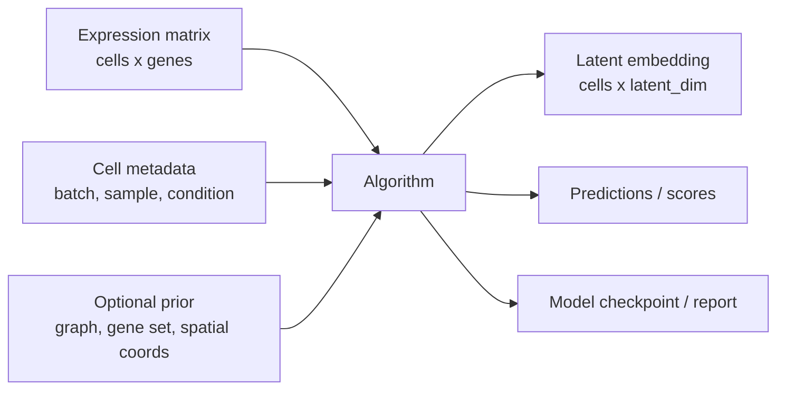
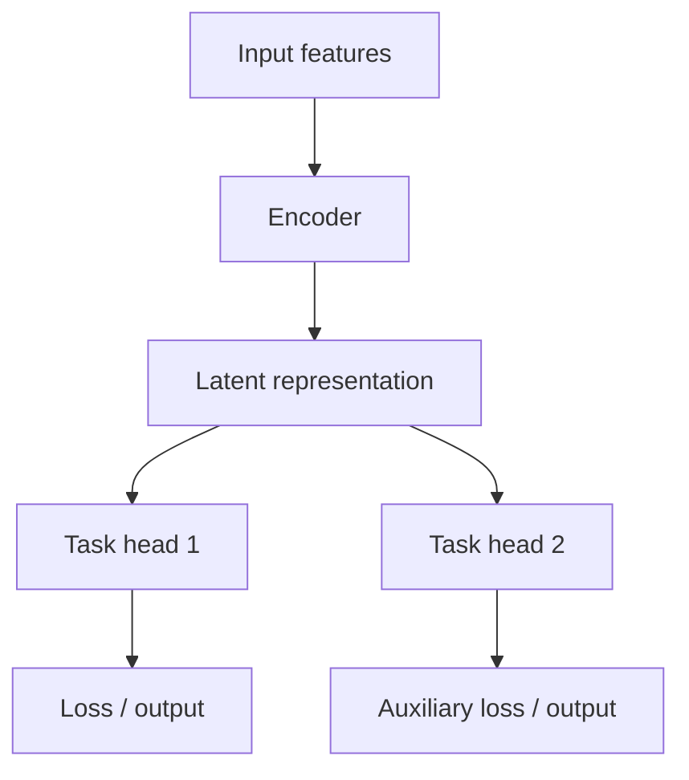

# 算法解读模板

> 这个页面是模板。收到具体文献后，我会复制这一结构，为每个算法生成独立页面。

## 1. 算法基本信息

| 项目 | 内容 |
|---|---|
| 算法名称 | 待填写 |
| 论文标题 | 待填写 |
| 发表信息 | journal/conference, year |
| GitHub 仓库 | URL |
| 任务类型 | integration / annotation / trajectory / spatial / perturbation / foundation model / other |
| 适用数据 | scRNA-seq / scATAC-seq / spatial / CITE-seq / multiome |

## 2. 算法作用

需要讲清楚：

1. 它解决什么生物学或计算问题。
2. 它输入什么数据，输出什么结果。
3. 它相对已有方法的改进点是什么。
4. 它不适合什么场景。

<div class="doc-callout important">
  <strong>判断标准</strong>
  <p>不能只复述摘要。需要能用自己的话解释：如果我是用户，为什么要用这个算法，而不是 Scanpy/Seurat/scVI/CellTypist/CellChat 等已有工具。</p>
</div>

## 3. 输入与输出

### 输入文件

| 输入 | 格式 | 形状/字段 | 必需 | 说明 |
|---|---|---|---|---|
| expression matrix | `.h5ad`, `.mtx`, `.csv`, `.tsv` | cells × genes | yes | 例如 raw counts 或 log-normalized matrix |
| metadata | `.csv`, `.tsv`, `adata.obs` | cells × covariates | depends | sample, batch, condition, cell type |
| gene metadata | `.csv`, `.tsv`, `adata.var` | genes × annotations | depends | gene symbol, gene id, chromosome |
| graph/spatial coordinates | `.h5ad`, `.csv` | cells/spots × coordinates | depends | spatial 或 graph model 需要 |

### 输出文件

| 输出 | 格式 | 形状/字段 | 用途 |
|---|---|---|---|
| latent embedding | `.npy`, `.csv`, `adata.obsm` | cells × latent_dim | downstream neighbors/UMAP/clustering |
| prediction labels | `.csv`, `adata.obs` | cells × labels | annotation/classification |
| scores/probabilities | `.csv`, `.h5ad` | cells × classes | confidence/uncertainty |
| trained model | `.pt`, `.pkl`, checkpoint dir | model weights | reuse/inference |

## 4. 输入输出示意图



## 5. 模型结构详解

这一节要参考论文模型图和代码实现，逐层拆解：

<div class="check-grid">
  <article>
    <strong>Data encoder</strong>
    <span>输入矩阵如何进入模型？是否使用 counts distribution, log-normalized expression, graph, or tokens？</span>
  </article>
  <article>
    <strong>Core module</strong>
    <span>核心结构是什么？VAE, GNN, Transformer, contrastive learning, diffusion, or probabilistic model？</span>
  </article>
  <article>
    <strong>Decoder / head</strong>
    <span>输出如何生成？重构表达、分类标签、link score、velocity, or perturbation response？</span>
  </article>
  <article>
    <strong>Loss function</strong>
    <span>训练目标包括哪些项？reconstruction, KL, contrastive, classification, graph regularization, or adversarial loss？</span>
  </article>
</div>

### 模型结构示意图



## 6. 训练与推理流程

### 训练

```text
load data -> preprocess -> build dataset -> initialize model -> train loop -> validate -> save checkpoint
```

需要记录：

1. batch size, epochs, optimizer, learning rate。
2. 是否使用 GPU。
3. 是否需要 negative sampling 或 graph construction。
4. random seed 和版本依赖。

### 推理

```text
load checkpoint -> load query data -> align genes/features -> run inference -> export results
```

需要特别检查 query 数据是否和 training/reference 数据的 gene space、normalization 和 metadata 一致。

## 7. GitHub 代码阅读记录

| 模块 | 文件路径 | 作用 | 需要重点读的函数/类 |
|---|---|---|---|
| data loading | `path/to/data.py` | 读取输入和构建 dataset | `Dataset`, `collate_fn` |
| model | `path/to/model.py` | 定义模型结构 | `Model`, `forward` |
| training | `path/to/train.py` | 训练循环 | `train`, `loss_fn` |
| inference | `path/to/predict.py` | 推理和导出 | `predict`, `save_results` |
| config | `configs/*.yaml` | 参数配置 | model/data/training sections |

## 8. 复现最小流程

```bash
git clone <repo-url>
cd <repo>
conda env create -f environment.yml
conda activate <env>
python scripts/preprocess.py --input data/example.h5ad --output data/processed.h5ad
python train.py --config configs/example.yaml
python predict.py --checkpoint outputs/model.pt --query data/query.h5ad
```

## 9. 结果解释

需要回答：

1. 输出结果应该如何读。
2. 哪些图或指标用于验证算法是否正常。
3. 哪些结果容易过度解释。
4. 与传统方法或 baseline 如何比较。

## 10. 常见问题与风险

<div class="check-grid">
  <article>
    <strong>输入格式不匹配</strong>
    <span>gene order, gene ID, barcode, metadata, normalization 不一致会让结果失真。</span>
  </article>
  <article>
    <strong>论文图和代码不完全一致</strong>
    <span>需要以实际仓库代码为准，并标注论文描述与实现差异。</span>
  </article>
  <article>
    <strong>默认参数不可泛化</strong>
    <span>示例数据参数不一定适合真实队列、跨平台数据或大规模 atlas。</span>
  </article>
  <article>
    <strong>评估指标单一</strong>
    <span>需要同时看 biological conservation, batch mixing, accuracy, calibration, and runtime。</span>
  </article>
</div>

