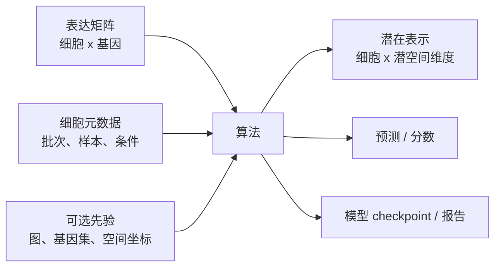
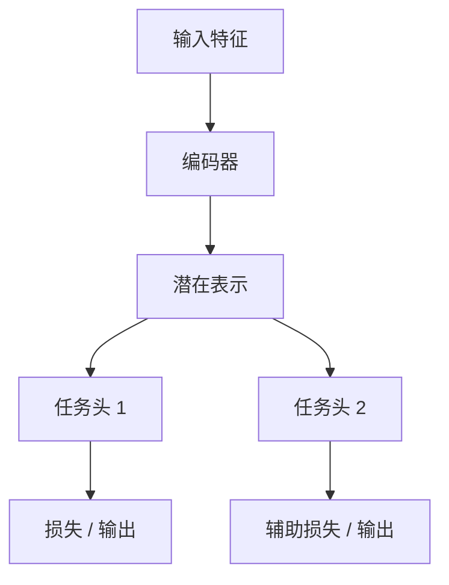

# 算法解读模板

> 这个页面是模板。收到具体文献后，我会复制这一结构，为每个算法生成独立页面。

## 1. 算法基本信息

| 项目 | 内容 |
|---|---|
| 算法名称 | 待填写 |
| 论文标题 | 待填写 |
| 发表信息 | 期刊/会议、年份 |
| GitHub 仓库 | URL |
| 任务类型 | 整合 / 注释 / 轨迹 / 空间 / 扰动 / 基础模型 / 其它 |
| 适用数据 | scRNA-seq / scATAC-seq / 空间组学 / CITE-seq / 多组学 |

## 2. 算法作用

需要讲清楚：

1. 它解决什么生物学或计算问题。
2. 它输入什么数据，输出什么结果。
3. 它相对已有方法的改进点是什么。
4. 它不适合什么场景。

<div class="doc-callout important">
  <strong>判断标准</strong>
  <p>不能只复述摘要。需要能用自己的话解释：如果我是用户，为什么要用这个算法，而不是 Scanpy/Seurat/scVI/CellTypist/CellChat 等已有工具。</p>
</div>

## 3. 输入与输出

### 输入文件

| 输入 | 格式 | 形状/字段 | 必需 | 说明 |
|---|---|---|---|---|
| 表达矩阵 | `.h5ad`, `.mtx`, `.csv`, `.tsv` | 细胞 × 基因 | 是 | 例如原始计数或对数归一化矩阵 |
| 元数据 | `.csv`, `.tsv`, `adata.obs` | 细胞 × 协变量 | 视方法而定 | 样本、批次、条件、细胞类型 |
| 基因元数据 | `.csv`, `.tsv`, `adata.var` | 基因 × 注释 | 视方法而定 | 基因符号、基因 ID、染色体 |
| 图或空间坐标 | `.h5ad`, `.csv` | 细胞/点位 × 坐标 | 视方法而定 | 空间模型或图模型需要 |

### 输出文件

| 输出 | 格式 | 形状/字段 | 用途 |
|---|---|---|---|
| 潜在表示 | `.npy`, `.csv`, `adata.obsm` | 细胞 × 潜空间维度 | 下游邻居图/UMAP/聚类 |
| 预测标签 | `.csv`, `adata.obs` | 细胞 × 标签 | 注释/分类 |
| 分数/概率 | `.csv`, `.h5ad` | 细胞 × 类别 | 置信度/不确定性 |
| 训练后的模型 | `.pt`, `.pkl`, checkpoint 目录 | 模型权重 | 复用/推理 |

## 4. 输入输出示意图



## 5. 模型结构详解

这一节要参考论文模型图和代码实现，逐层拆解：

<div class="check-grid">
  <article>
    <strong>数据编码器</strong>
    <span>输入矩阵如何进入模型？是否使用计数分布、对数归一化表达、图结构或 token？</span>
  </article>
  <article>
    <strong>核心模块</strong>
    <span>核心结构是什么？VAE、GNN、Transformer、对比学习、扩散模型还是概率模型？</span>
  </article>
  <article>
    <strong>解码器 / 任务头</strong>
    <span>输出如何生成？重构表达、分类标签、连接分数、RNA 速率还是扰动响应？</span>
  </article>
  <article>
    <strong>损失函数</strong>
    <span>训练目标包括哪些项？重构、KL、对比学习、分类、图正则化还是对抗损失？</span>
  </article>
</div>

### 模型结构示意图



## 6. 训练与推理流程

### 训练

```text
读取数据 -> 预处理 -> 构建数据集 -> 初始化模型 -> 训练循环 -> 验证 -> 保存 checkpoint
```

需要记录：

1. 批大小、训练轮数、优化器、学习率。
2. 是否使用 GPU。
3. 是否需要负采样或图构建。
4. 随机种子和版本依赖。

### 推理

```text
读取 checkpoint -> 读取查询数据 -> 对齐基因/特征 -> 运行推理 -> 导出结果
```

需要特别检查查询数据是否和训练/参考数据的基因空间、归一化方式和元数据一致。

## 7. GitHub 代码阅读记录

| 模块 | 文件路径 | 作用 | 需要重点读的函数/类 |
|---|---|---|---|
| 数据读取 | `path/to/data.py` | 读取输入和构建数据集 | `Dataset`, `collate_fn` |
| 模型 | `path/to/model.py` | 定义模型结构 | `Model`, `forward` |
| 训练 | `path/to/train.py` | 训练循环 | `train`, `loss_fn` |
| 推理 | `path/to/predict.py` | 推理和导出 | `predict`, `save_results` |
| 配置 | `configs/*.yaml` | 参数配置 | model/data/training sections |

## 8. 复现最小流程

```bash
git clone <repo-url>
cd <repo>
conda env create -f environment.yml
conda activate <env>
python scripts/preprocess.py --input data/example.h5ad --output data/processed.h5ad
python train.py --config configs/example.yaml
python predict.py --checkpoint outputs/model.pt --query data/query.h5ad
```

## 9. 结果解释

需要回答：

1. 输出结果应该如何读。
2. 哪些图或指标用于验证算法是否正常。
3. 哪些结果容易过度解释。
4. 与传统方法或基线方法如何比较。

## 10. 常见问题与风险

<div class="check-grid">
  <article>
    <strong>输入格式不匹配</strong>
    <span>基因顺序、基因 ID、条形码、元数据、归一化方式不一致会让结果失真。</span>
  </article>
  <article>
    <strong>论文图和代码不完全一致</strong>
    <span>需要以实际仓库代码为准，并标注论文描述与实现差异。</span>
  </article>
  <article>
    <strong>默认参数不可泛化</strong>
    <span>示例数据参数不一定适合真实队列、跨平台数据或大规模图谱。</span>
  </article>
  <article>
    <strong>评估指标单一</strong>
    <span>需要同时看生物学保留、批次混合、准确率、校准情况和运行时间。</span>
  </article>
</div>
